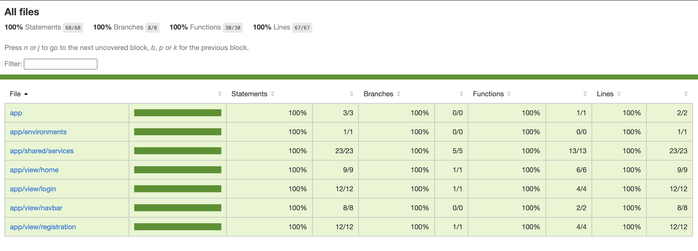

# Authorization App

This is a fully functional application that allows the user to view a secret message. By clicking the **"Reveal Secret"** button, the secret stored as a message in the Java controller is displayed. However, to successfully view this message, you must first **register and log in**.

## Running the Application

The application is divided into **backend (Spring Boot)** and **frontend (Angular 18)**. The entire project is configured using **Docker Compose** for easy startup.

1. Make sure you're in the root directory of the project.
2. Start the application with the following command:

   ```sh
   docker compose up --build
   ```

   This command will automatically build and start all necessary services, including the PostgreSQL database.
3. After successful startup, the application will be available at: http://localhost:4200

## Technologies Used

### Backend (Spring Boot, Java 17)
- Spring Boot - a framework for rapid backend application development.
- Spring Web - enables the implementation of a REST API.
- Spring Security - provides authentication and authorization.
- Spring Data JPA - used for working with a PostgreSQL database.
- PostgreSQL Driver - JDBC driver for PostgreSQL.
- Lombok - reduces boilerplate code.

### Authentication and Security
- JWT tokens - generate a key to authenticate users.
- Symmetric encryption HS256 - token signing with HMAC-SHA256.
- The token is valid for 30 minutes - after this time a new one must be obtained.
- CORS Policy - handled via a CORS filter to allow communication between frontend and backend applications.

### Frontend (Angular 18)
- Standalone components - traditional Angular modules are not used.
- Angular HTTP Interceptor - for intercepting HTTP request responses.
- Bootstrap - used for basic UI and styling of the application.
- ngx-toastr - informs the user about application states (e.g., successful login).
- RxJS - used for reactive data handling.
- The token is stored in Local Storage - so it's available even after closing the browser window.

### Frontend Testing
- We have written unit tests to verify application functionality. The final report is shown below.

